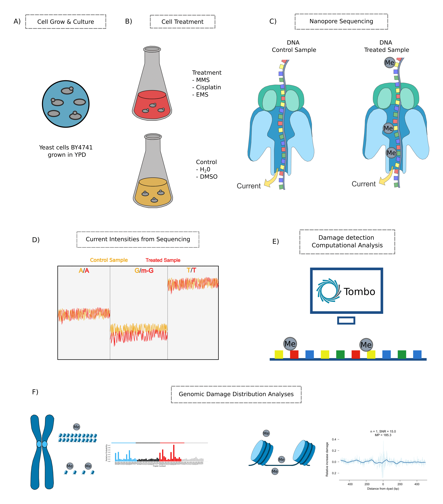

# Nano analysis
Recently, Nanopore long-read sequencing has emerged as a novel technology to enable direct detection of DNA modifications. Here, the idea is to explore the capabilities of Nanopore sequencing data to directly map a variety of DNA damages to the yeast genome in an unsupervised manner. The objective of the scripts is to shed light on the challenging question of whether it is possible to detect damage without previous knowledge and with a low damage proportion. For that we generate the pipeline shown in the following figure: 

# Contents
- [Installation](#Installation)
- [Usage](#Usage)        

# Installation
## Clone repository
First download the repository:

        git clone https://github.com/pepebonet/nano_damage.git

## Install dependencies
We highly recommend to use a virtual environment to run the scripts: 

`Create environment and install nano_damage:`

        conda create --name nanodamage python=3.7
        conda activate nanodamage
        conda install -c anaconda pycurl
        conda install -c bioconda pybedtools
        conda install -c bioconda ont-tombo
        pip install -r requirements.txt

# Usage

## Handle Raw Fast5 files

The objective here is to go from multi-fast5 to resquiggled fast5 files. To do so three things need to be done. 

1.- Get the subset of reads of your treatment:

        fast5_subset --input path_to_input/ --save_path path_to_output/ --read_id_list ../sequencing_summary_treatment.txt --batch_size 2000 -t 56

2.- Get single reads: 

        multi_to_single_fast5 --input_path multi_reads/ --save_path single_reads/ --threads 56

3.- Resquiggle with Tombo: 
        
        tombo resquiggle single_read/ path_to_reference_genome/ --processes 56 --num-most-common-errors 5

These can also be done by adapting the Snakemake pipeline in the `simulation` folder. Changes to both the Snakefile and config.yaml will be needed. Then in the folder run the following:
        
        snakemake --cores 56

## Detect Modifications (Tombo)

Next, ones the reads are resquiggled tombo detect needs to be run to get the DNA modifications. To do so remember that you need matched samples (treated and untreated). 

        tombo detect_modifications level_sample_compare --fast5-basedirs path_to_untreated_sample/ --alternate-fast5-basedirs path_to_treated_sample/ --statistics-file-basename sample_comparison_p_val --fishers-method-context 2 --minimum-test-reads 20 --multiprocess-region-size 1000 --processes 56 --num-most-significant-stored 8000000 --store-p-value

## Enrichment

Given a folder containing the data `data_folder` the enrichment script can be run for the different treatments as follows (the -pv and -ms commands can vary based on needs): 

        python scripts/enrichment_tombo.py -o output_folder/ -cl  chromatin_features/chromosome_info_yeast/sacCer3.chrom.sizes -d data_folder/sample_comparison_p_val.tombo.stats -ls -ms 1000000 -pv 0.0000001

## Nucleosomes Norm

After the damage and the enrichment is obtained we want to focus only in the nucleosome. Therefore, the commands below are run: 

        python scripts/nucleosome_damage_norm.py -da output_folder/damage_most_sig_Nanopore.tsv -ni nucleosome_info/saccer3/brogaard_saccer3.bed.nooverlapp.bed.gz -ed output_folder/triplet_normalized_Nanopore.tsv -o output_folder/

## Randomizations

Once the damage in the nucleosomes is obtained the following commands need to be run to obtain the randomizations of the damage (remember the -nr parameter for the number of randomizations to reduce the running time): 

        python scripts/randomizations_damage.py -dn output_folder/damage_in_nucleosomes.tsv -ed output_folder/triplet_normalized_Nanopore.tsv -p -o output_folder/

## Zoom out 

On top of looking at the nucleosomes, we can also look at differences between nucleosome and linkers and check for the periodicity. To do so, the following commands are needed: 

        python scripts/zoom_out_nuc.py -da output_folder/damage_most_sig_Nanopore.tsv -ni nucleosome_info/saccer3/brogaard_saccer3.bed.nooverlapp.bed.gz -o output_folder/ -ed output_folder/triplet_normalized_Nanopore.tsv

## Chromatin features

To understand the enrichment for different chromatin structures in the genome (open-close, subtelomeric regions, origins of replications ...) we run the following:  

        python scripts/structure_analysis/structure.py -sd output_folder/damage_most_sig_Nanopore.tsv -o output_folder/ -pt both -ro chromatin_features/origins_replication/origins_replication.csv -nd chromatin_features/nuc_depleated_reg/NDR_regions.csv -chl chromatin_features/chromosome_info_yeast/sacCer3.chrom.sizes -a chromatin_features/accessibility/DNase-seq_saccer3.bed.gz -m chromatin_features/mappability/ -ts chromatin_features/transcription/ -po chromatin_features/polIII/polII_occupancy.bedgraph

## Mao Data 

Commmand to run the Mao data analysis (Repeat for other pairs of data with As):

        python scripts/miscellaneous/analysis_mao_data.py  -ms path_to_mao_data/GSM2585798_wt_0hr_A2_1bp_Greads_bk_minus.bed -ps path_to_mao_data/GSM2585798_wt_0hr_A2_1bp_Greads_bk_plus.bed -cl chromatin_features/chromosome_info_yeast/sacCer3.chrom.sizes -o path_to_mao_data/Gs/

## Sancar Data

Commands to run the sancar data properly:

1.- Get the fastqs 

        fasterq-dump SRR3623538 -O output/ -e 56
        fasterq-dump SRR3623539 -O output/ -e 56

2.- Extracting the damage from the Cisplatin Sancar data following their guidelines. This scripts has paths hardcoded and need to be modified in order to work: 

        python scripts/miscellaneous/raw_data_processing_sancar.py

3.- Analysis of the damage to get the enrichment profiles:

        python scripts/miscellaneous/analysis_sancar_data.py -r1 path_to_sancar_data/SRR3623538/dedup/analysis_files_hg19/SRR3623538_1.discarded_misligated.BED_unsorted -r2 path_to_sancar_data/SRR3623539/dedup/analysis_files_hg19/SRR3623539_1.discarded_misligated.BED_unsorted -cl path_to_chromosome_human_genome/UCSC/hg19/Sequence/Chromosomes/ -o path_to_sancar_data/